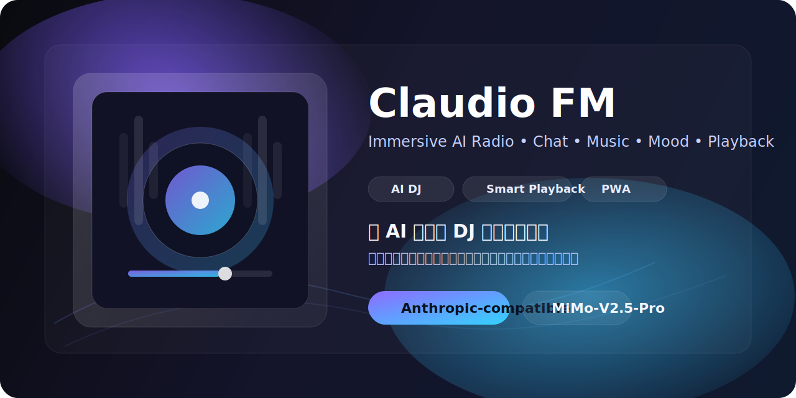
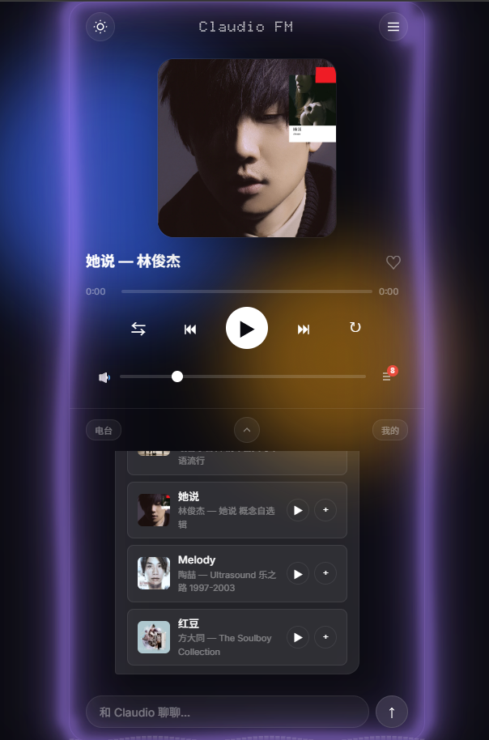
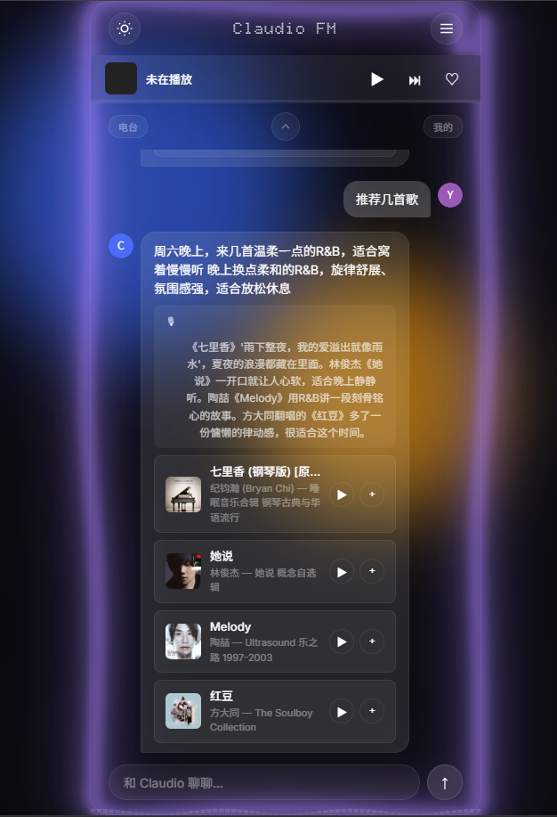
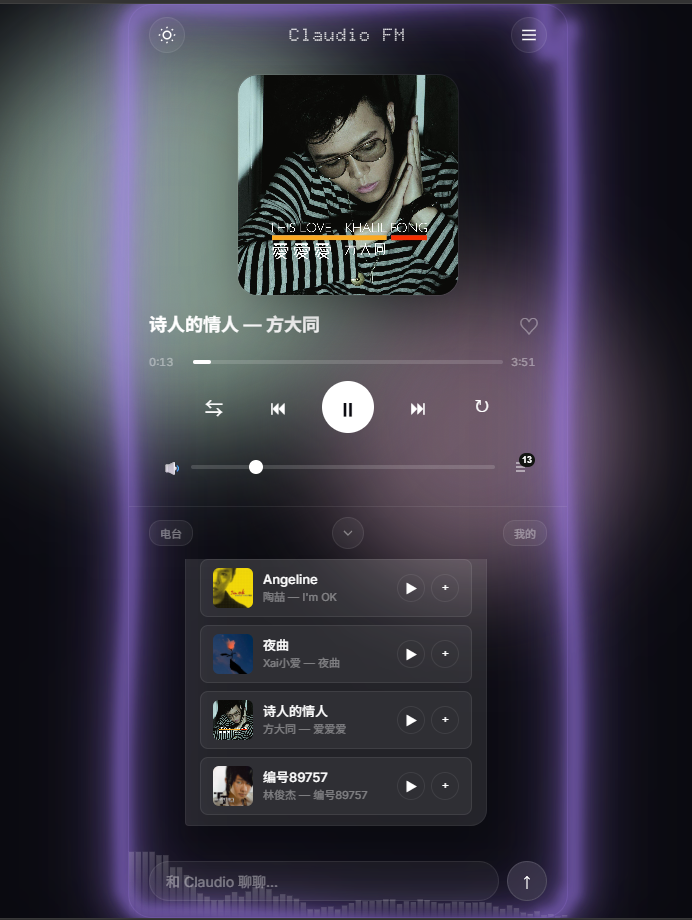

<div align="center">



# Claudio FM

### An immersive AI Radio web app for music, chat, mood, and playback

<p>
  
  
  
  
  
  
</p>

**模仿 mmguo 风格 AI 电台体验，结合 AI DJ 对话、音乐推荐、播放器联动、歌词翻页和沉浸式视觉氛围。**

作者注：使用Claude-code + MiMo-V2.5-Pro模型 + vibe-coding + sleep-coding

</div>

---

## 目录

- [项目简介](#项目简介)
- [效果预览](#效果预览)
- [核心特性](#核心特性)
- [为什么这个项目有意思](#为什么这个项目有意思)
- [技术栈](#技术栈)
- [简易功能介绍](#简易功能介绍)
- [项目结构](#项目结构)
- [环境变量](#环境变量)
- [快速开始](#快速开始)
- [运行逻辑](#运行逻辑)
- [后续扩展方向](#后续扩展方向)
- [致谢](#致谢)
- [License](#license)

---

## 项目简介

Claudio FM 是一个偏产品原型与体验设计导向的 AI 音乐项目。

它把这些东西组合在了一起：

- **AI DJ 对话**：你可以直接和 Claudio 聊天、点歌、问歌、聊氛围
- **音乐推荐联动**：AI 回复不只是文字，还能转成可播放歌曲卡片
- **播放器体验**：封面、歌词、队列、收藏、历史、续播都整合在同一套交互里
- **电台氛围 UI**：动态取色、流体背景、歌词翻页、频谱感、DJ voice mode

它不是传统意义上的播放器，也不是普通聊天机器人，而是更像一个：

> **会陪你听歌、懂上下文、还能顺手把歌播起来的 AI 电台搭子。**

---

## 效果预览

### Home / Player / Chat

<p align="center">
  
  
  
</p>

---

## 核心特性

### 1. AI DJ 对话体验
- 支持自然语言聊天
- AI 可结合当前播放歌曲继续对话
- 支持结构化返回 `say / reason / play / segue`
- 聊天记录自动保存，刷新后可恢复历史内容

### 2. 音乐推荐与播放联动
- AI 推荐歌曲后自动生成歌曲卡片
- 支持一键播放 / 加入当前播放队列
- 支持 `搜索xxx`、`播放xxx`、下一首、暂停等简单指令
- 自动通过网易云搜索补全真实歌曲信息与可播放音源

### 3. 沉浸式播放器
- 专辑封面、歌词、播放控制整合在同一页面
- 支持播放 / 暂停 / 上一首 / 下一首 / 随机 / 循环
- 支持音量调节、迷你播放器、播放列表面板
- 自动保存播放状态，支持跨会话续播

### 4. 歌词与视觉氛围
- 封面可翻转进入歌词页
- 歌词随播放进度高亮滚动
- 根据专辑封面自动取色驱动整页主题
- 带流体背景、氛围光晕、频谱感 UI

### 5. DJ Voice Mode
- 支持 DJ 语音沉浸模式
- 在推荐/讲歌场景下触发更像“电台播报”的表达方式
- 带波形展示，让反馈更有陪伴感

### 6. 本地化与持久化
- SQLite 存储收藏、历史记录、聊天记录、偏好设置、播放状态
- 支持收藏歌曲、最近播放、聊天历史持久化
- 无需额外数据库服务，个人项目开箱即用

### 7. 可配置 AI 模型
- 后端使用 `@anthropic-ai/sdk`
- 支持配置 `ANTHROPIC_BASE_URL`
- 支持通过 `ANTHROPIC_MODEL` 切换模型
- 可接入 **MiMo-V2.5-Pro** 等 Anthropic-compatible 模型

---

## 为什么这个项目有意思

### 不是“AI + 播放器”拼接，而是真联动
AI 的输出会直接影响播放器行为，而不是只停留在聊天气泡里。

### 不是只做功能，而是明显在做氛围
这个项目很强调“数字电台感”和“陪伴感”，视觉、声音、交互都是围绕这个目标去搭的。

### 架构不重，但完整度够高
纯前端页面 + Node.js 单服务 + SQLite，本地跑起来很轻，但功能闭环已经比较完整。

### 很适合继续二开
适合往这些方向继续扩展：
- AI Radio
- AI DJ
- 音乐陪伴类产品
- AI + 内容消费体验
- Anthropic-compatible 接口实践项目

---

## 技术栈

### Frontend
- HTML
- CSS
- Vanilla JavaScript
- Web Audio API
- Web Speech API
- PWA / Service Worker

### Backend
- Node.js
- Express
- SQLite (`better-sqlite3`)
- Anthropic SDK (`@anthropic-ai/sdk`)

### Third-party / API
- Anthropic-compatible API
- 网易云音乐 API

---

## 简易功能介绍

| 功能 | 说明 |
| --- | --- |
| AI 聊天 | 和 Claudio 聊天，问歌、点歌、聊氛围 |
| 歌曲搜索 | 输入“搜索xxx”或“播放xxx”快速找歌 |
| 智能推荐 | AI 返回推荐歌曲卡片，可直接播放 |
| 收藏系统 | 收藏喜欢的歌曲并持久化保存 |
| 历史记录 | 自动记录最近播放和聊天内容 |
| 播放队列 | 支持当前播放列表查看与管理 |
| 续播能力 | 关闭页面后再次打开可恢复播放状态 |
| 主题氛围 | 动态背景、自动取色、歌词翻页、频谱氛围 |
| 配置面板 | 页面内可查看并修改 API 相关配置 |
| DJ Voice Mode | 进入更像电台播报的语音沉浸模式 |

---

## 项目结构

```bash
claudio/
├── server.js
├── package.json
├── .env
├── .env.example
├── data/
│   └── claudio.db
├── config/
├── public/
│   ├── index.html
│   ├── css/
│   ├── js/
│   ├── manifest.json
│   └── sw.js
└── docs/
    └── screenshots/
```

---

## 环境变量

复制 `.env.example` 为 `.env`，并按需修改：

```env
ANTHROPIC_API_KEY=your_api_key_here
ANTHROPIC_BASE_URL=your_base_url_here
ANTHROPIC_MODEL=MiMo-V2.5-Pro
NETEASE_API=your_netease_api_here
NETEASE_COOKIE=your_netease_cookie_here
PORT=3001
```

### 字段说明

| 变量名 | 说明 |
| --- | --- |
| `ANTHROPIC_API_KEY` | Anthropic 兼容接口的 API Key |
| `ANTHROPIC_BASE_URL` | Anthropic 兼容接口 Base URL |
| `ANTHROPIC_MODEL` | 使用的模型名，例如 `MiMo-V2.5-Pro` |
| `NETEASE_API` | 网易云音乐 API 服务地址 |
| `NETEASE_COOKIE` | 网易云 Cookie，用于获取更多可用内容 |
| `PORT` | 本地服务端口 |

---

## 快速开始

### 1. 安装依赖

```bash
npm install
```

### 2. 准备环境变量

```bash
cp .env.example .env
```

Windows 如果没有 `cp`，手动复制一份也可以。

### 3. 启动项目

```bash
npm run start
```

开发模式：

```bash
npm run dev
```

### 4. 打开浏览器

```bash
http://localhost:3001
```

如果你修改了 `PORT`，请对应替换端口号。

---

## 运行逻辑

```text
用户输入消息
   ↓
服务端判断是否为简单指令 / 搜索 / AI 对话
   ↓
简单指令 → 直接控制播放器
搜索请求 → 调用网易云 API
自然语言 → 调用 Anthropic-compatible 模型
   ↓
返回文本 / 推荐歌曲 / segue / 语音内容
   ↓
前端渲染聊天气泡、歌曲卡片、播放器状态与视觉效果
```

---

## 后续扩展方向

- 接更多音乐平台
- 接更完整的 TTS 服务，而不只依赖浏览器语音
- 增加 AI 长期记忆和用户音乐画像
- 增加每日推荐 / 情绪电台 / 自动歌单生成
- 增加账号系统、云同步、多端续播
- 增加更完整的移动端 PWA 安装体验

---

## 致谢

- 灵感参考：**mmguo 风格 AI 电台**
- 开发辅助：**Claude Code**
- AI 接口：**Anthropic-compatible API**
- 音乐能力：**网易云音乐 API**

---

## License

MIT
